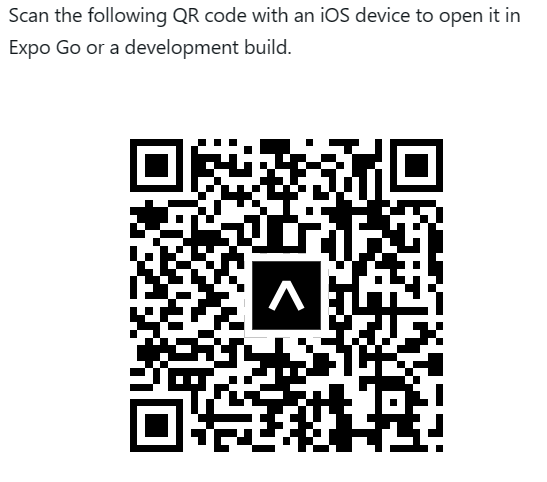

### **MDSHOP: Full Stack Ecommerce Mobile Application Documentation**

MDSHOP is a full-stack e-commerce mobile application developed using React Native for the frontend and Node.js with Express and MongoDB for the backend. It provides a wide array of features for users and administrators to manage products, orders, accounts, and payments.

#### Features

1. **User Management**

   - Users can browse, view, and add products to their cart.
   - Seamless checkout using Cash on Delivery (COD) or Stripe payment gateway integration.
   - Account creation, login, and profile picture addition.
   - Forgot password feature with OTP-based password reset.

2. **Admin Panel**
   - Product management: Add, update, and delete products.
   - Order status management.

#### Technology Stack

##### Frontend Libraries

- React Native
- Redux Toolkit
- Expo Camera
- Expo Image Picker
- React Native Chart Kit
- React Native Paper
- React Native Snap Carousel

##### Backend Libraries

- Node.js
- Express
- Stripe API
- Multer
- Cloudinary
- Bcrypt.js
- Mongoose

#### Testing Instructions

To test the application:

1. **For Android Users:**

   - Download Expo Go on your Android smartphone.
   - Scan the provided QR code below within Expo Go.
   - 

2. **For iOS Users:**
   - Download Expo Go on your Apple smartphone.
   - Scan the provided QR code below within Expo Go.
   - 

**Note:** The backend server might experience a delay of up to 90 seconds due to server sleep if hosted on a free tier. If products fail to load initially, consider restarting the app. This delay is not a bug but an issue related to free tier hosting.

#### Backend Setup

##### Environment Variables

Ensure the following environment variables are set for the backend:

- `PORT`
- `MONGODB_URI`
- `STRIPE_API_SECRET`
- `JWT_SECRET`
- `JWT_EXPIRES_TIME`
- `cookie_EXPIRES_TIME`
- `MYWEBSITE`
- `SMTP_HOST`
- `SMTP_PORT`
- `SMTP_EMAIL`
- `SMTP_PASSWORD`
- `SMTP_FROM_EMAIL`
- `SMTP_FROM_NAME`
- `CLOUDINARY_NAME`
- `CLOUDINARY_API_KEY`
- `CLOUDINARY_API_SECRET`

**Note:** If the backend is running locally, use the IPv4 address instead of "localhost". You can find the IPv4 Address by typing `ipconfig` in the command prompt. Modify the backend link in `/mobile/stateManagement/store.js` to your backend link followed by `/v2/api`, e.g., `http://localhost:5000/v2/api`.

#### Starting the Frontend

1. Navigate to the `mobile` directory.
2. Run `npm install` to install dependencies.
3. Initiate the application with `npm start`.

#### Starting the Backend

1. Navigate to the `backend` directory.
2. Run `npm install` to install dependencies.
3. Start the backend server using `npm start`.

**Important:** Ensure that the backend environment variables are properly set before running the backend server.

### Postman API Documentation

Explore the backend API documentation through Postman using the provided link below:

[Postman API Documentation](https://documenter.getpostman.com/view/14542680/2s9YXb95fk)

Set the Postman environment variable `network` to `http://localhost:5000`.

This documentation provides an overview of the MDSHOP application, its features, technology stack, and setup instructions for both frontend and backend. For further development or testing, refer to this guide and ensure the necessary dependencies and configurations are in place.
